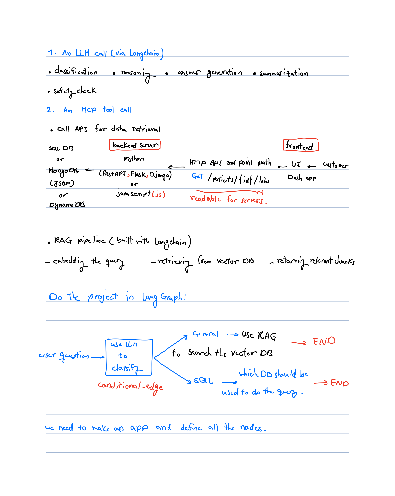
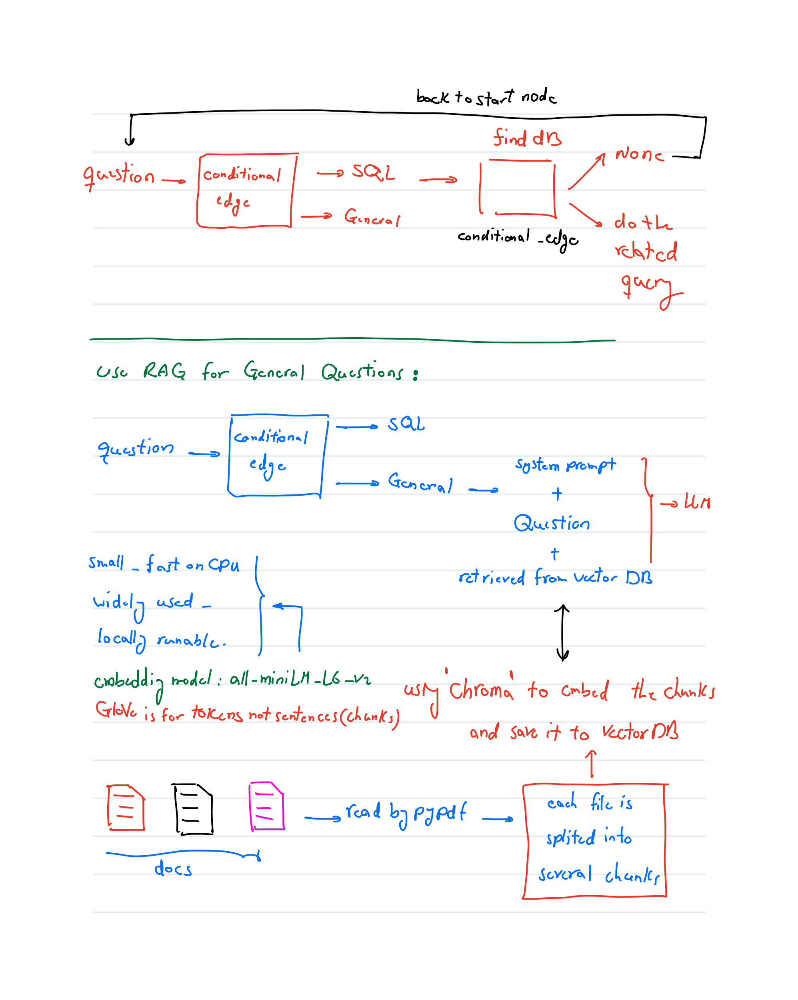

# Make Agentic AI use LangGraph

## 1. 🛠️ Installing Poetry

To install [Poetry](https://python-poetry.org/) (Python dependency management and packaging tool), run the following command in your terminal:

```bash
curl -sSL https://install.python-poetry.org | python3 -
```

After installation, make sure Poetry is in your `PATH`
- macOS/Linux
```bash
export PATH="$HOME/.local/bin:$PATH
```

Verify installation:

```bash
poetry version
```

Keep venv inside the project (works great with VS Code) poetry 

```bash
config virtualenvs.in-project true
```
This environment is set with Python 3.13. Change the requires-python = ">=3.13" in pyproject.tmol file if you have other versions on your PC.

run:
```bash
poetry install
```

In case if you want to make environment from scratch, run:(Do not recommended)

```bash
poetry new project_name
```

## 2. Download Ollama installer

Ollama is like a car that you can use different engines(models) for your job [Ollama](https://ollama.com/download).<br>

Then in the terminal, paste the following line to install the model on the Ollama.<br>

```bash
ollama run llama3.1
```

To exit from the Ollama, use `/bye` in macOs and `Ctrl+d` in window.<br>


## 3. AI Stack
AI Stack: Collection of software, hardware, tools, and frameworks(models) used to build, deploy, and manage AI applications.
<br>
<br>


## 4. Connecting Langchain to llama

First, you  need to install `langchain` on the the virtual environment. In the terminal whre the `pyproject.toml` is locating, paste the following commands:
```bash
poetry add langchain
poetry add langchain_community
poetry add langchain-ollama
poetry add pandas
poetry add openpyxl
poetry add ipykernel
```

To install langchain, you should have python >=3.10. If you get error regarding the range of the python, change this line `requires-python = ">=Your-python-version"` in `pyproject.toml` to `requires-python = ">=Your-python-version"`(removing ">=").<br>

After installing the langchain, there is `sample.py` file in the `test` directory, that tested the connection of langchain with llama model installed locally by asking simple question in the prompt. The parameter `temperature` control randomness. Since we want to be precise, it should be zero. Ollama is running on the localhost `127.0.0.1 or localhost` with port number `11434`, so if you paste `curl 127.0.0.1:11434` in terminal, you will see Ollama is running.


## 5. LangGraph

To orchestrate the flow, I used LangGraph to define nodes.
Inside each node, depending on what the task requires, I use either an LLM (via LangChain) or an MCP tool — and an MCP tool can internally call APIs, databases, or even run a RAG pipeline.<br>
To install the required packages paste the following lines into the terminal:
```bash
poetry add langgraph
poetry add sqlalchemy
poetry add langchain-experimental
poetry add pypdf
poetry add chromadb
poetry add sentence-transformers
```

First we start with defining the `app` object. The app is build by the function `build_graph`. The input of this function is `AgentState` which is not a real class, it is a type hint for a dictionary, not an object with behavior. Langgraph needs to know the following characteristics: <br>
- Which keys exist in the state? It needs state schema(`AgentState`).<br>
- What types they have?<br>
- How to merge updates from nodes?<br>
- How to check if your nodes are correct?<br>
The main function in the `base_func.py` file is `build_graph`, which orchestrates the flow between the nodes.
`AgentState` is a template or schema, not data. `TypeDict` describes the shape of a dict. LangGraph workflows expect a dict-like state not class. `x: Optional[int]` means `x` can be `int` or `None`. `x:Literal["sql","reject"]` means `x` can be `"sql"` or `"reject"`. No other string is allowed. State is the memory dictionary that flows between nodes of the graph. The state is the data that gets passed from node to node. Each node receives this state, modifies part of it, and returns the updated state.<br>
`graph.add_node` adds a node to the LangGraph workflow. A node in LangGraph is one step (one function) in your agent’s flow. Each node receive something from node, compute something, write back to the state. <br>
In each graph, we need to define the starting node, which is defined by `graph.set_entry_point`. The flow between the nodes can be either defined by `graph.add_edge` or by `graph.add_conditional_edges`, which defines branching logic (i.e., how the graph decides where to go next based on the state).

## 6. Starting node
After getting the `question` from the user in the `start_node` function, there is an simple edge between this node and the node `classify_question_node`. The `classify_question_node` will decide whether the question is `SQL` or it is a `GENERAL` question. Then there is a conditional edge that decides the agent should proceed with SQL-related functions or General question related functions. The finction `router1_decision` will guide the agent. If the question was `SQL` related, the agent will proceed with `find_db_name`; otherwise, the agent will proceed with `general_node`. In the following, each path will be explained separately.

## 7. SQL Queries

If the agent specifies that the question was `SQL` query, it goes into `find_db_name`. Since we have different databases, in the `find_db_name` we determine the related DB that the query should be done on it. If it can not find the relevant one, it will start over and wants you to ask the question again. For doing the query, you can use `SQLDatabase` from `langchain_community.utilities` or  `SQLDatabaseChain` from `langchain_experimental.sql`. To use `SQLDatabase`, you need to give an actual SQL query. `llm` will get the natural language (`question`) as input and give the SQL code as the output. On the other hand, `SQLDatabaseChain` will get the natural language as input and do all the transformation inside itself. I think using a good `system_prompt`, the `SQLDatabase` is more reliable. 

## 8. General Queries

Before doing the general queries, we have to use the most updated data to do the queries. To do so, there are two approaches to update the model, and it depends on the use case, which one we are going to choose. The first method is to fine-tune the language model with the updated data. This approach results in faster inference; however, it may result in catastrophic forgetting. The second method is using Retrieval augmented generation (RAG) or Cache augmented generation (CAG). The second approach is safer to use, but inference takes much time. In this repo, I have used RAG. Firstly, I split my PDF file into chunks, then embedded them into VectorDB using `Chroma`. `Chroma` is embedding sentences; however, `GloVe` is embedding tokens. `sentence-transformers/all-MiniLM-L6-v2` model is used in `HuggingFaceEmbeddings` to embed the chunks. Then in the `general_node`, we retrieve the most related chunks by comparing the user question and vectorDB, and then combine it with the user question and system prompt as an input to the LLM model. The output of the LLM model is the user's answer.


<br>
<br>
<br>