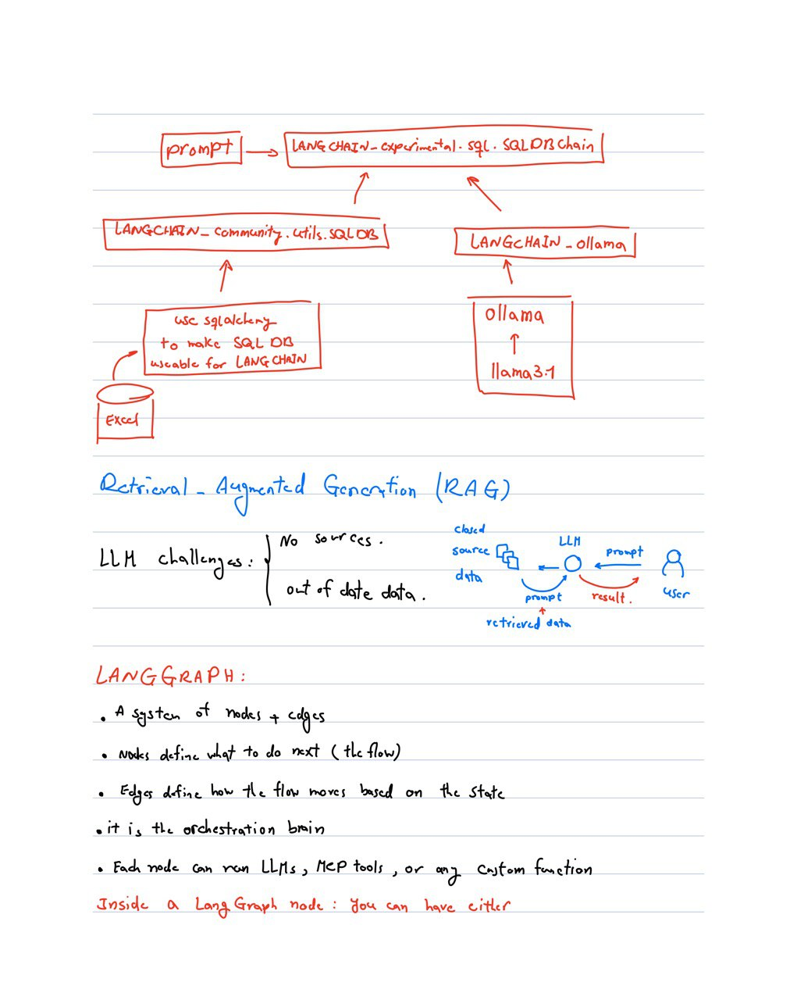
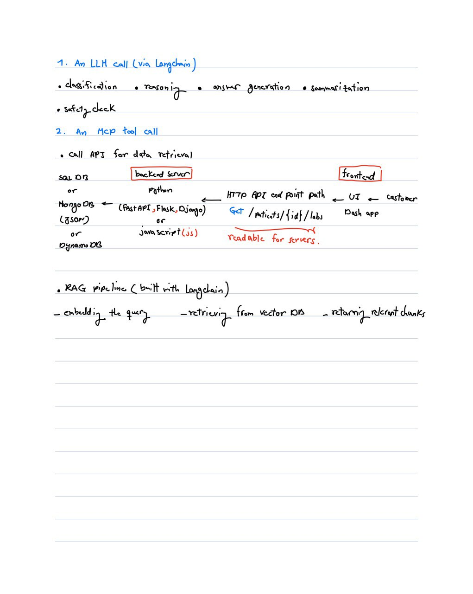

# Make Agentic AI use LangGraph

## 1. 🛠️ Installing Poetry

To install [Poetry](https://python-poetry.org/) (Python dependency management and packaging tool), run the following command in your terminal:

```bash
curl -sSL https://install.python-poetry.org | python3 -
```

After installation, make sure Poetry is in your `PATH`
- macOS/Linux
```bash
export PATH="$HOME/.local/bin:$PATH
```

Verify installation:

```bash
poetry version
```

Keep venv inside the project (works great with VS Code) poetry 

```bash
config virtualenvs.in-project true
```
This environment is set with Python 3.13. Change the requires-python = ">=3.13" in pyproject.tmol file if you have other versions on your PC.

run:
```bash
poetry install
```

In case if you want to make environment from scratch, run:(Do not recommended)

```bash
poetry new project_name
```

## 2. Download Ollama installer

Ollama is like a car that you can use different engines(models) for your job [Ollama](https://ollama.com/download).<br>

Then in the terminal, paste the following line to install the model on the Ollama.<br>

```bash
ollama run llama3.1
```

To exit from the Ollama, use `/bye` in macOs and `Ctrl+d` in window.<br>


## 3. AI Stack
AI Stack: Collection of software, hardware, tools, and frameworks(models) used to build, deploy, and manage AI applications.
<br>
<br>


## 4. Connecting Langchain to llama

First, you  need to install `langchain` on the the virtual environment. In the terminal whre the `pyproject.toml` is locating, paste the following commands:
```bash
poetry add langchain
poetry add langchain_community
poetry add langchain-ollama
poetry add langgraph
poetry add pandas
poetry add openpyxl
poetry add ipykernel
```

To install langchain, you should have python >=3.10. If you get error regarding the range of the python, change this line `requires-python = ">=Your-python-version"` in `pyproject.toml` to `requires-python = ">=Your-python-version"`(removing ">=").<br>

After installing the langchain, there is `sample.py` file in the `test` directory, that tested the connection of langchain with llama model installed locally by asking simple question in the prompt. The parameter `temperature` control randomness. Since we want to be precise, it should be zero. Ollama is running on the localhost `127.0.0.1 or localhost` with port number `11434`, so if you paste `curl 127.0.0.1:11434` in terminal, you will see Ollama is running.


## 5. LangGraph

To orchestrate the flow, I used LangGraph to define nodes.
Inside each node, depending on what the task requires, I use either an LLM (via LangChain) or an MCP tool — and an MCP tool can internally call APIs, databases, or even run a RAG pipeline.

First we start with defining the `app` object. The app is build by the function `build_graph`. The input of this function is `AgentState` which is not a real class, it is a type hint for a dictionary, not an object with behavior. Langgraph needs to know the following characteristics: <br>
- Which keys exist in the state? It needs state schema(`AgentState`).<br>
- What types they have?<br>
- How to merge updates from nodes?<br>
_ How to check if your nodes are correct?<br>
`AgentState` is a template or schema, not data. `TypeDict` describes the shape of a dict. LangGraph workflows expect a dict-like state not class. `x: Optional[int]` means `x` can be `int` or `None`. `x:Literal["sql","reject"]` means `x` can be `"sql"` or `"reject"`. No other string is allowed. State is the memory dictionary that flows between nodes of the graph. The state is the data that gets passed from node to node. Each node receives this state, modifies part of it, and returns the updated state.<br>
`graph.add_node` adds a node to the LangGraph workflow. A node in LangGraph is one step (one function) in your agent’s flow. Each node receive something from node, compute something, write back to the state. <br>
`add_conditional_edges` defines branching logic (i.e., how the graph decides where to go next based on the state)

## 6. SQL node using Langchain


<br>
<br>